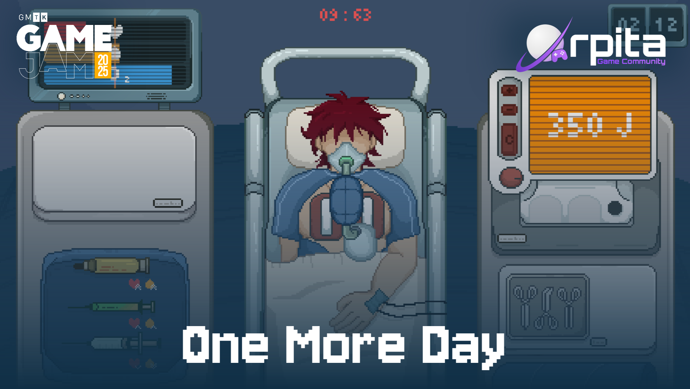

  

<h1 align="center">🩺 One More Day</h1>

  <strong>A short narrative-driven game created for GMTK Game Jam 2025</strong> 
  <em>Theme: "Loop"</em>

  
  
  

---

## 📖 About the Game

**One More Day** is a short narrative-driven game created in **96 hours** for **GMTK Game Jam 2025**.

Play as **Dr. Zain**, a young doctor whose routine hospital shift quickly spirals into a desperate race against time. Explore the hospital, meet its staff, and experience a story where every moment and every decision counts.

Built around the theme **"Loop"**, the project blends narrative, exploration, and emotional storytelling into a compact game jam experience.

> *"One more patient. One more decision. One more day."*

---

## 🏆 Game Jam Results

We are proud to share our results from **GMTK Game Jam 2025**, where we ranked in the top percentages across all categories out of 9,520 entries.

| Category | Rank | Top Percentage |
|----------|------|----------------|
| Narrative | #1694 | Top 17.8% |
| Artwork | #2704 | Top 28.4% |
| Audio | #3488 | Top 36.6% |
| Creativity | #6307 | Top 66.2% |
| Enjoyment | #6784 | Top 71.2% |

---

## ✨ Features

- 📖 Narrative-driven gameplay with emotional storytelling
- 🏥 Explore a detailed hospital environment
- ⏳ Time-critical moments that shape the story
- 🎵 Original soundtrack and sound effects
- 🎮 Created in 96 hours for GMTK Game Jam 2025

---

## 🎮 Play the Game

You can play **One More Day** for free on itch.io:

👉 **[Play One More Day on itch.io](https://orpita-community.itch.io/one-more-day)**

---

## 👥 Credits

**One More Day** was developed by members of **Orpita Community** together with talented external contributors during GMTK Game Jam 2025.

### Community Leadership

- **Amr Elmahdy** – Founder & CEO

### Game Design

- **Amr Elmahdy** – Head of Game Design
- Youssef Soliman
- Nourhan Amr
- Mariam Motaz
- Amira Emad
- Fatima Nader

### Game Development

- **Youssef Amr** – Head of Game Development
- Mark Asaad
- Mahmoud
- Fares Khaled
- Sherifa Sayed

### Art Direction

- **Esraa Adel** – Head of Game Artist

### Music & Sound

- Amr Elkhelawy
- Josif Ali (Jomoa)
- Alex

### Additional Art

- Chase (Gobstopper)
- Kino

For the complete list of contributors, see [`CONTRIBUTORS.md`](./CONTRIBUTORS.md).

---

## License

This project is **All Rights Reserved**.

Copyright (c) 2025 Orpita Game Community and the respective contributors.

**Important notes:**

- This repository is published for archival, documentation, educational viewing, and portfolio purposes only.
- The source code and assets may **NOT** be copied, modified, forked, mirrored, redistributed, or used to create derivative works without prior written permission from the Community Representative.
- Team Members (as listed under "Orpita Community Members" in `CONTRIBUTORS.md`) may showcase their personal contributions in portfolios and social media.
- External Contributors (as listed under "External Contributors" in `CONTRIBUTORS.md`) are acknowledged for their contributions but do not hold Team Member status.
- For permission requests, please contact: orpitastudios@gmail.com.

See the full [`LICENSE`](./LICENSE) file for complete terms.

---

## Contributing

We are **not accepting external contributions** at this time.

If you are a former Team Member and wish to contribute to the Project, please contact the Community Representative.

See [`CONTRIBUTING.md`](./CONTRIBUTING.md) for contribution terms.

---

## Contact

- **Community Representative**: Amr Elmahdy
- **Email**: orpitastudios@gmail.com

**Made with passion by Orpita Game Community**

*Created for GMTK Game Jam 2025*

